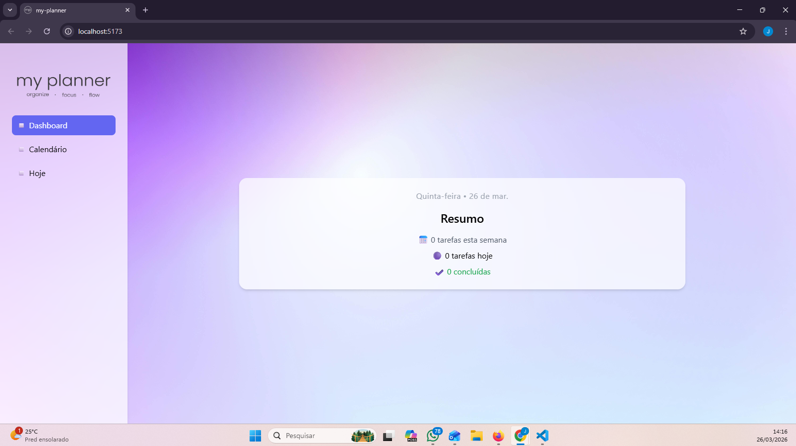
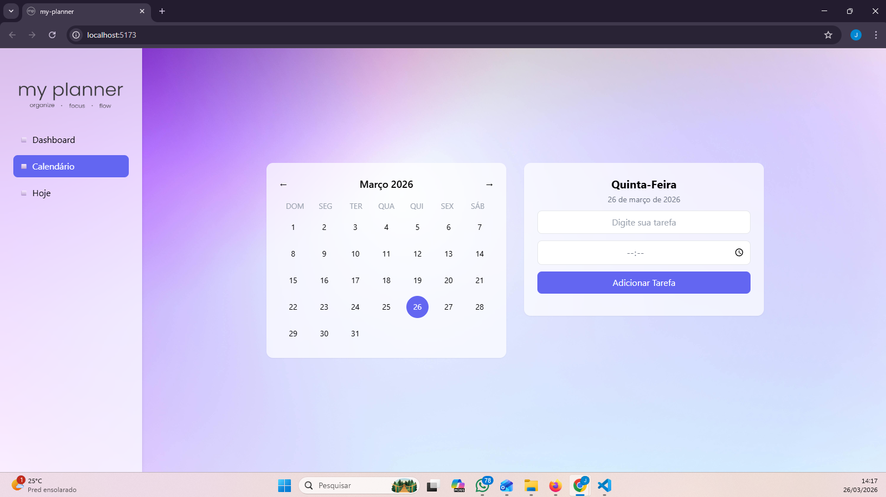
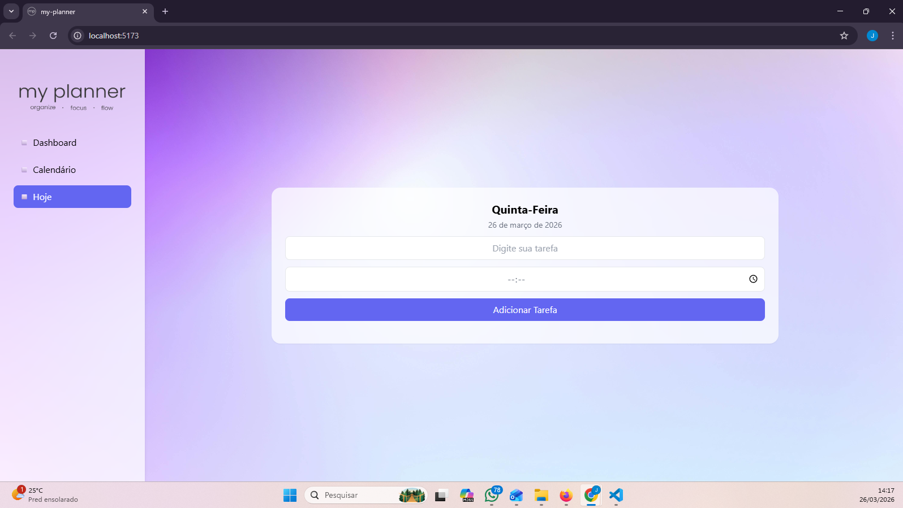

# 📋 Planner App

Aplicação de gerenciamento de tarefas com calendário e organização diária.

## 🚀 Funcionalidades
- Criar e remover tarefas
- Marcar como concluída
- Organização por data
- Visualização por "Hoje", Calendário e Dashboard
- Adição de horário nas tarefas

## 🛠️ Tecnologias
- React
- JavaScript
- TailwindCSS

## 💡 Objetivo
Projeto desenvolvido para praticar React e evoluir na transição para a área de tecnologia.

## 📸 Preview

### Dashboard


### Calendário


### Tarefas de Hoje


## 🔗 Deploy
-

## ▶️ Como rodar
```bash
npm install
npm run dev

